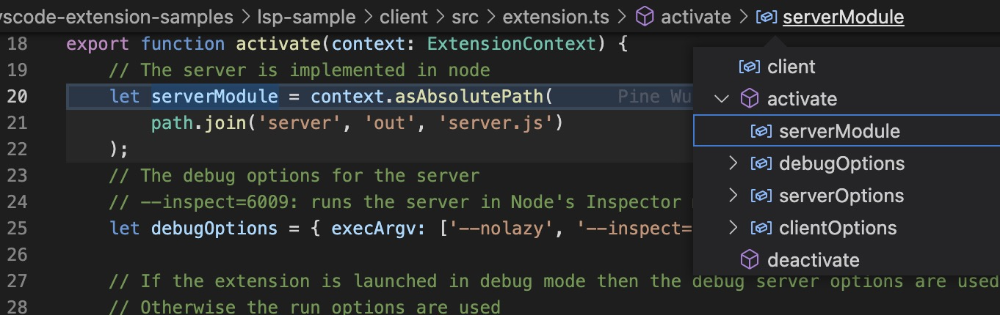
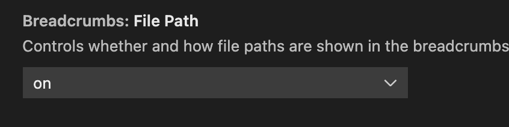

At this point, these notes are for my personal usage.
They are likely somewhat contradictory.

I will present here (in the future github.io page) my open source programming endeavors.
They will probably be mostly raku related (rakudo, nqp and MoarVM)
with an emphasis to everything connex to the rakudo grammar engine,
especially slangs.
There will also probably be stuff about typescript, [vscode](https://en.wikipedia.org/wiki/Visual_Studio_Code)
 (particularly extensions),
[wasm](https://en.wikipedia.org/wiki/WebAssembly) (maybe in relation to rust) and sveltejs.


[purpose](#Purpose of a parse tree browser)

The following discussion was originally intended to discuss the 
implementation of the parse tree breadcrumbs bar as compared to the vanilla bbar. 
I had to explain the larger context.

Breadcrumbs bar [[1]](https://code.visualstudio.com/docs/getstarted/userinterface#_breadcrumbs),
[[2]](https://code.visualstudio.com/docs/getstarted/userinterface#_breadcrumbs)
explained in the vscode documentation with a picture I borrowed from there


||
|:--:|
| <b>Breadcrumb bar on top with opened <a href="https://code.visualstudio.com/api/references/vscode-api#QuickPick">quickpick</a> menu</b>|


|  
|:--:|
|<b>Vscode bbar in action with a dropdown menu</b>|

# integration in vscode

- hbar: horizontal bar
- vbar: vertical bar
- bbar : breadcrumbs hbar
- sbbar: semantic bar
- ebar: editor bar
- status bar: items are not draggable and their new position remembered. Low hanging fruit? Way to learn
- zones: tentative name. will contain hbars
- lower zone : currently contains only the status bar
- upper zone : current absent. configurable to extend or not up/below the panels 

## Group Editor bars

Currently there are two group editor hbars. The bbar and the open editors bar.
I think they could be drag and droppable to the zones.


## discussion

I discuss here how a hbar and bbar can fit in vscode taxonomy. I will point to
the docs and code I should study to go further.

A bar contains items. Bars are ideal for items of the same size in their
orthogonal direction. A vbar with. Square icons fits well both in bbars and
hbars. But my concern here is bar with item of different size.

The [user interface](https://code.visualstudio.com/docs/getstarted/userinterface)
documentation speaks of bars, some are views or contains view, some views (all?) are drag and droppable.
I distinguish vbars (vertical bars) and hbars (horizontal bars).

In western language word are of different length and are horizontally spread. 
So hbar is ideal for a sequence of items which are mostly words. An item can be adorned
by a icon. An example of such an hbar is a sbbar.


A bbar is a special kind of bar which is a specialized view which 
are used in certain places. Probably a bbar should use the 
[tree view](https://code.visualstudio.com/api/extension-guides/tree-view) API.

An extension example  with treeview is 
[here](https://github.com/Microsoft/vscode-extension-samples/tree/main/tree-view-sample)

A bar should be hooked into a vscode extension 
[contribution point](https://code.visualstudio.com/api/references/contribution-points).
I must understand what are views and view containers
Should a bar be a specialisation of a view or a different contribution point


The current bbar is "hardwired" in vscode. But vscode folllow the design
patterns of the gang of four so it should not be too hard to repurpose it if I
understand these said patterns.


# purpose of a parse tree browser


It will help writing and reading grammars.

See [Specification](#Specification) for the vocabulary.


# Writing a rakudo parse tree browser

The parse tree browser should allow to debug grammars.
That means there is a way to keep the parse tree even for a failed
parse. A failed parse will be a top match with a false boolean value.
What is a failed parse should not be a problem unlike for regular regexes
where backtracking would loose the failed but meaninful parse.

I will discuss two possible implementations. One using the 
existing bbar with existing [LSP](https://microsoft.github.io/language-server-protocol/) facilities. It is a good way
step toward a full LSP based raku support but will not make
possible most of the discusse features. Another way will 
necessitate a good knowledge of the breadcrumb API. 
There is another fork here. One implementation would replicate
most of the bbar code to implement the parse tree bbar.
It will be a hack because it will plug itself in the existing DON
thanks to the CSSclass.

After a LSP partial parse tree bbar support, the next easier step 
is to support [semantic highligting](https://code.visualstudio.com/api/language-extensions/semantic-highlight-guide)

This [page](https://code.visualstudio.com/blogs/2017/02/08/syntax-highlighting-optimizations) may be relevant 

# Specification

The navigation can be done either from the bbar or from the editor. At any time
a reducing rule of the parse tree is current. The selection covers the string
reduced by the said rule. Some keybinding (probably from the bbar but also
accessible without focus on the bbar) allows to move up one step in the parse
tree. Another keybind will move up the tree to a node that reduces a larger
string.

The user moves the cursor on the parsed file editor and the bbar 
displays the path from the top of the parse tree to the leaf token.

### A few word about dynamic variables

Raku grammars are designed to parse very contextual languages. 
Some context is conveyed down the parse tree thru [dynamic variable](https://andrewshitov.com/2018/10/31/dynamic-variables-in-perl-6/).
They drive the parsing itself and the associated action.
Long lasting context is stored in the world dynvar $*W
that is a instance of [Perl6::World](https://github.com/rakudo/rakudo/blob/master/src/Perl6/World.nqp#L179)

Next we will discuss the rules view which will involve dynamic variable

### the rules view

It shows the rules for the path from the top to a leaf.
For a given rule, the values of the dynamic variables 
it defines, sets or use are somehow
accessible. 

On the right a view displays the rules used for the parsing.

### An access point to documentation

Eventually this should be a way to learn about the language and about raku
grammar. When the parse file is a grammar, this will be the occasion to
document the role of grammar dynamic variable. When clicking a variable would
open the doc about variables.

It will be first used to document my upcoming slangs.
The raku story was confusing enough for introducing slangs without
a learning path. 
A discussion of [AST](https://gist.github.com/cognominal/d1996f19537a85947741) slang.
in a gist.

The format of the documentation should allow translators to independantly
provide a translation from their own repo. The owner of the main documentation
will just have to specify the repos for the different translations.

Each sentence will be uniquely identified by some SHA1s.
A sentence will be written in markdown. But it would be
good to have a sha1 for the unmarked sentence.

A cut and paste of a sentence must preserve its identity.
A graphical interface should allow a translator to know what 
sentences must be translated and updated.

Code may or may not be translated. For the time being code is considered
as minimal translation unit like a sentence.

We may allow the possibility to use the documentation to learn a language
and display the sentence original and its translation on top of each other.

It is unclear if the documentation will be transcluded in the rules view
and the transclusion

Also later AST can enter into the game.


http://www.parsifalsoft.com/gloss.html
https://nearley.js.org/docs/glossary

A while ago, I dabbled in writing a parse tree browser using [Svelte](https://en.wikipedia.org/wiki/Svelte).
I had written some code to generate json from the 
[parse tree](https://en.wikipedia.org/wiki/Parse_tree) of a rakudo 
file. Now I have changed my mind and want to use a vscode extension to implement the 
parse tree browser. I was inspired by the vscode breadcrumbs bar (bbar)

||
|:--:|
| <b>Breadcrumb bar on top with opened <a href="https://code.visualstudio.com/api/references/vscode-api#QuickPick">quickpick</a> menu</b>|


## Language service provider

## breadcrumb bar

This bar allows to explore and navigate 
code for the file with thee cursor focus seen as an arborescence. 
You can even do that navigation from the keyboard.
This breadcrumbs bar (bbar) is composed of 
two sections if the [language service provider](https://code.visualstudio.com/api/language-extensions/language-server-extension-guide) (LSP) is supported 
for the language for the current file.
Enries from the first section are the path from the git repo folder to 
the current file. The next entries are recursive structures that lead to 
the one under the cursor.
Currently raku does not support the LSP so we got only the first bbar section.

It is tempting to use a breadcrumb bar for navigating the raku parse tree.
It is possible to generate json from the raku parse tree to communicate with 
vscode to generate the breadcrumb bar content.


I am tempted to create a second breadcrumb bar instead of using LSP
to have more real estate. But it would oblige me to mess with vscode internals.
There is no support to add a second breadcrumb bar.
With the developper tools, I was able to find the css class breadcrumbs-tab and 
from that the code that handle breadcrumb bar. So I possibly could write an extension 
that would bypass that limitation of vscode API.

Raku parse trees are very deep. 
To save real estate, I would like subpath which matches reduce the same string to
be displayable.

raku parse is done in stages and you can display the output of
a particular stage. Here we have the parse tree for the 
`say "hello"` expression. Each corresponds to the reduction for a rule.
We see that the EXPR/args/arglist/value/quote is the path for the 
reduction of the `"hello"` string. 


## parse tree 

```
raku --target=parse -e 'say "hello"'
- statementlist: say "hello"
  - statement: 1 matches
    - EXPR: say "hello"
      - args:  "hello"
        - arglist: "hello"
          - EXPR: "hello"
            - value: "hello"
              - quote: "hello"
                - nibble: hello
      - longname: say
        - name: say
          - morename:  isa NQPArray
          - identifier: say
        - colonpair:  isa NQPArray
```
<p><center><b>Parse tree</b></center></p>

Note : the matches uses the position in the string. LSP thinks in term of lines and columns.

To save space on the bbar 
by a menu under the top one of the subpath. I don't think it is possible with the LSP
API and/or the current breadcrum API.

I could do that but supporting this second breacrumb bar would lead 
me to no progress to support full LSP services for raku.
then I discovered that the configuration 

||
|:--:|
| <b>An option to control file paths display in a breadcrumb bar</b>|


So far, to start simple, I want to navigate the parse tree for a unique file
with a json parse tree generated in advance.


. So getting 
rid of the first bbar section would not be a nuisance as long as I am 
interested in raku parse tree.


## Menus and commands

As I want to create a dedicated breadcrumb bar to navigate parse trees I 
must understand the code. 


An .appendMenuItem and .registerCommandAndKeybindingRule use 
the same id breacrumbs.focusAndSelect. This common id  probably explains 
why the title set in the first appears in the keybinding search panel 
instead of the id.


```typescript
MenuRegistry.appendMenuItem(MenuId.CommandPalette, {
	command: {
		id: 'breadcrumbs.focusAndSelect',
		title: { value: localize('cmd.focus', "Focus Breadcrumbs"), original: 'Focus Breadcrumbs' },
		precondition: BreadcrumbsControl.CK_BreadcrumbsVisible
	}
});

KeybindingsRegistry.registerCommandAndKeybindingRule({
	id: 'breadcrumbs.focusAndSelect',
	weight: KeybindingWeight.WorkbenchContrib,
	primary: KeyMod.CtrlCmd | KeyMod.Shift | KeyCode.Period,
	when: BreadcrumbsControl.CK_BreadcrumbsPossible,
	handler: accessor => focusAndSelectHandler(accessor, true)
});


// this commands is only enabled when breadcrumbs are
// disabled which it then enables and focuses
KeybindingsRegistry.registerCommandAndKeybindingRule({
	id: 'breadcrumbs.toggleToOn',
	weight: KeybindingWeight.WorkbenchContrib,
	primary: KeyMod.CtrlCmd | KeyMod.Shift | KeyCode.Period,
	when: ContextKeyExpr.not('config.breadcrumbs.enabled'),
	handler: async accessor => {
		const instant = accessor.get(IInstantiationService);
		const config = accessor.get(IConfigurationService);
		// check if enabled and iff not enable
		const isEnabled = BreadcrumbsConfig.IsEnabled.bindTo(config);
		if (!isEnabled.getValue()) {
			await isEnabled.updateValue(true);
			await timeout(50); // hacky - the widget might not be ready yet...
		}
		return instant.invokeFunction(focusAndSelectHandler, true);
	}
});


// focus/focus-and-select
function focusAndSelectHandler(accessor: ServicesAccessor, select: boolean): void {
	// find widget and focus/select
	const groups = accessor.get(IEditorGroupsService);
	const breadcrumbs = accessor.get(IBreadcrumbsService);
	const widget = breadcrumbs.getWidget(groups.activeGroup.id);
	if (widget) {
		const item = tail(widget.getItems());
		widget.setFocused(item);
		if (select) {
			widget.setSelection(item, BreadcrumbsControl.Payload_Pick);
		}
	}
}
```

## vscode layout

The `viewMap` give the topmost parts of a vscode window. hbars would belong within the
`editorPartView` like the current crumbars does. But within the `viewMap` there should
be two zones 

			[Parts.HBAR_LOWER_ZONE_PART]: this.HBarLowerZonePartView,
			[Parts.HBAR_TOP_ZONE_PART]: this.HBarTopZonePartView,


https://github.com/Microsoft/vscode/blob/4d40ea2343cf7f2bf2ca22e91e7786262bda6728/src/vs/workbench/browser/layout.ts