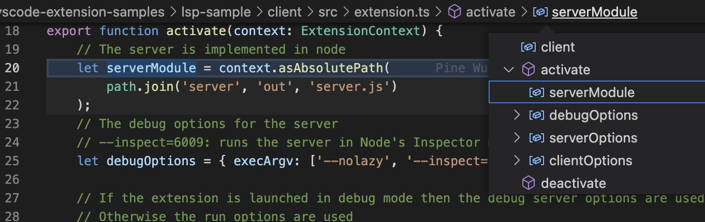

Writing a raku parse tree browser

A while ago. I dabbled writing a parse tree browser using SvelteJs.
I had written some code to generate json from the parse tree of a rakudo 
file. Now I have changed my mind and want to use vscode to write the 
parse tree browser. I was inspired by the vscode breadcrumbs bar (bbar)




This bar allows to explore and navigate 
code for the file with thee cursor focus seen as an arborescence. 
You can even do that navigation from the keyboard.
This breadcrumbs bar (bbar) is composed of 
two sections if the language service provider (LSP) is supported 
for the language for the current file.
Enries from the first section are the path from the git repo folder to 
the current file. The next entries are recursive structures that lead to 
the one under the cursor.
Currently raku does not support the LSP so we got only the first bbar section.

It is tempting to use a breadcrumb bar for navigating the raku parse tree.
It is possible to generate json from the raku parse tree to communicate with 
vscode to generate the breadcrumb bar content.


I am tempted to create a second breadcrumb bar instead of using LSP
to have more real estate. But it would oblige me to mess with vscode internals.
There is no support to add a second breadcrumb bar.
With the developper tools, I was able to find the css class breadcrumbs-tab and 
from that the code that handle breadcrumb bar. So I possibly could write an extension 
that would bypass that limitation of vscode API.

I have already dabbled with raku parse tree and it is very deep. 
To save real estate, I would like subpath which matches reduce the same string to be displayable
by a menu under the top one of the subpath. I don't think it is possible with the LSP
API and/or the current breadcrum API.

I could do that but supporting this second breacrumb bar would lead 
me to no progress to support full LSP services for raku.
then I discovered that the configuration 


So far, to start simple, I want to navigate the parse tree for a unique file
with a json parse tree generated in advance.


. So getting 
rid of the first bbar section would not be a nuisance as long as I am 
interested in raku parse tree.


As I want to create a breadcrumb bar to navigate parse trees I 
must understand the code. 


An .appendMenuItem and .registerCommandAndKeybindingRule use 
the same id breacrumbs.focusAndSelect. This common id  probably explains 
why the title set in the first appears in the keybinding search panel 
instead of the id.


```typescript
MenuRegistry.appendMenuItem(MenuId.CommandPalette, {
	command: {
		id: 'breadcrumbs.focusAndSelect',
		title: { value: localize('cmd.focus', "Focus Breadcrumbs"), original: 'Focus Breadcrumbs' },
		precondition: BreadcrumbsControl.CK_BreadcrumbsVisible
	}
});

KeybindingsRegistry.registerCommandAndKeybindingRule({
	id: 'breadcrumbs.focusAndSelect',
	weight: KeybindingWeight.WorkbenchContrib,
	primary: KeyMod.CtrlCmd | KeyMod.Shift | KeyCode.Period,
	when: BreadcrumbsControl.CK_BreadcrumbsPossible,
	handler: accessor => focusAndSelectHandler(accessor, true)
});


// this commands is only enabled when breadcrumbs are
// disabled which it then enables and focuses
KeybindingsRegistry.registerCommandAndKeybindingRule({
	id: 'breadcrumbs.toggleToOn',
	weight: KeybindingWeight.WorkbenchContrib,
	primary: KeyMod.CtrlCmd | KeyMod.Shift | KeyCode.Period,
	when: ContextKeyExpr.not('config.breadcrumbs.enabled'),
	handler: async accessor => {
		const instant = accessor.get(IInstantiationService);
		const config = accessor.get(IConfigurationService);
		// check if enabled and iff not enable
		const isEnabled = BreadcrumbsConfig.IsEnabled.bindTo(config);
		if (!isEnabled.getValue()) {
			await isEnabled.updateValue(true);
			await timeout(50); // hacky - the widget might not be ready yet...
		}
		return instant.invokeFunction(focusAndSelectHandler, true);
	}
});


// focus/focus-and-select
function focusAndSelectHandler(accessor: ServicesAccessor, select: boolean): void {
	// find widget and focus/select
	const groups = accessor.get(IEditorGroupsService);
	const breadcrumbs = accessor.get(IBreadcrumbsService);
	const widget = breadcrumbs.getWidget(groups.activeGroup.id);
	if (widget) {
		const item = tail(widget.getItems());
		widget.setFocused(item);
		if (select) {
			widget.setSelection(item, BreadcrumbsControl.Payload_Pick);
		}
	}
}
```